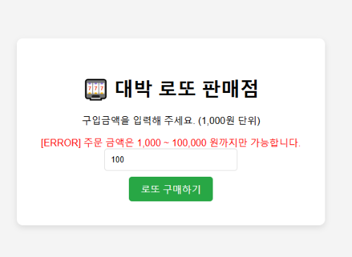
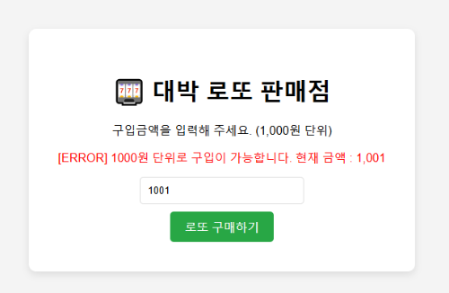
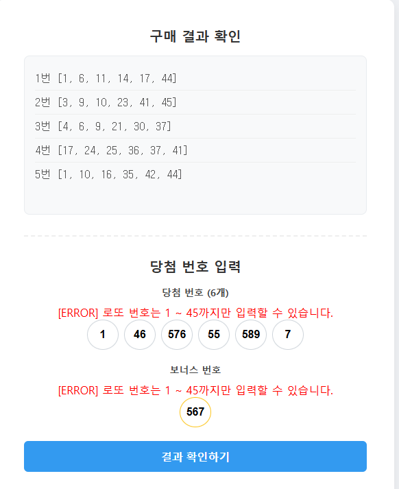
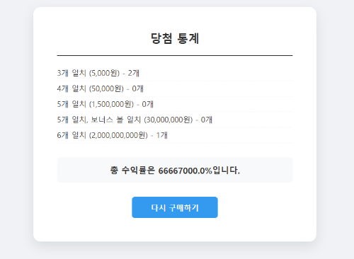

## Learning Log (study-log)
**Java Stream API부터 Spring MVC의 핵심 원리까지 처음부터 다시 학습하며 기록한 과정**을 담았습니다.
본 로또 프로젝트는 이렇게 다져진 단단한 기초 위에서 구현된 결과물입니다.

```text
study-log
├──  algo-practice            # 알고리즘 및 코딩테스트 연습 
├──  java-stream              # Java 8 Stream API 기본 개념 학습
├──  java-stream-practice     # Stream API 문제 풀이 
├──  spring-basic             # 스프링 핵심 원리 - 기본편 완강
├──  spring-mvc1              # 스프링 MVC 1편 - 백엔드 웹 개발 핵심
├──  spring-mvc2              # 스프링 MVC 2편 - 백엔드 웹 개발 활용
├──  item-service             # 웹 페이지 실습
└──  message                  # 스프링 메시지, 국제화 기능 실습
```
# Spring MVC Lotto Game

프리코스 과제인 **'로또 발매기'**를 **Spring MVC** 기반의 웹 애플리케이션으로 구현한 프로젝트입니다.

기존 콘솔 기반의 로직을 웹으로 확장하며, **오픈미션 기간 동안 집중적으로 학습했던 Spring MVC와 Java Stream API를 실제 코드에 적용**하여 구현했습니다.

<br>

## 주요 기능 및 화면 (Features & Screenshots)

### 1️⃣ 견고한 유효성 검증 (Robust Validation)
사용자의 잘못된 입력을 방지하기 위해 **Bean Validation(@Validated)**과 **커스텀 Validator**를 적용했습니다.

| 금액 범위 검증 | 금액 단위 검증 |
| :---: | :---: |
|  |  |
| *1,000원 ~ 100,000원 범위 제한* | *1,000원 단위 입력 제한* |

<br>

### 2️⃣ 구매 내역 확인 및 당첨 번호 입력
로또 구매 후 **자동 발급된 번호 목록**을 확인하고, 지난주 당첨 번호를 입력합니다.
이 과정에서도 **실시간 유효성 검증(중복, 범위)**을 통해 사용자 실수를 방지합니다.

| 구매 목록 & 입력 검증 | 당첨 통계 결과 |
| :---: | :---: |
|  |  |
| *구매 내역 확인 및 필드별 에러 검증* | *수익률 및 당첨 내역 출력* |

<br>

### 3️⃣ 사용자 친화적 에러 페이지 (Custom Error Pages)
시스템 오류(500)나 잘못된 경로 접근(404) 시, 화이트라벨 에러 페이지 대신 **커스텀 디자인된 페이지**를 제공하여 사용자 경험을 개선했습니다.

| 404 Not Found (잘못된 경로) | 500 Server Error (서버 오류) |
| :---: | :---: |
|  |  |

<br>

## 📂 패키지 구조 (Package Structure)
MVC 패턴에 맞춰 역할을 명확히 분리하였습니다.

```text
src/main
├──  java
│   └── change.lottoMission.lotto
│       ├── controller
│       │   └── LottoSpringController.java  # 웹 요청 처리 및 흐름 제어
│       │
│       ├──  model
│       │   ├──  dto
│       │   │   ├── PurchaseMoney.java      # 구입 금액 데이터 전달
│       │   │   └── WinningForm.java        # 당첨 번호 입력 폼 데이터
│       │   │
│       │   ├── Lotto.java                  # 로또 도메인 (번호 관리 및 비교 로직)
│       │   ├── LottoManager.java           # 핵심 비즈니스 로직 (당첨 결과 계산)
│       │   └── LottoRank.java              # 당첨 등수 및 상금 관리 (Enum)
│       │
│       ├──  util
│       │   ├── CalculationUtils.java       # 수익률 및 수량 계산
│       │   ├── LottoNumberGenerator.java   # 랜덤 번호 생성
│       │   └── LottoValidator.java         # 중복 및 보너스 번호 검증
│       │
│       └──  LottoMissionApplication.java # 실행 메인 클래스
│
└──  resources
    ├── static                              # 정적 리소스 (css, js)
    ├── templates                           # 뷰 템플릿 (Thymeleaf)
    │   ├── error                           # 에러 페이지 (4xx, 5xx)
    │   └── lottos                          # 로또 관련 화면 (구매, 확인, 결과)
    ├── application.properties              # 스프링 설정
    └── errors.properties                   # 에러 메시지 관리
```

<br>

## 핵심 기능 및 구현 (Key Features)

### 1\. 로또 구매

  * **기능:** 구입 금액을 입력받아 자동 로또 번호를 발행합니다.
  * **검증:**
      * `1,000원` \~ `100,000원` 사이의 금액만 입력 가능 (`@Range`)
      * 1,000원 단위로 나누어떨어지지 않는 경우 예외 처리 (`BindingResult` Global Error)

### 2\. 당첨 번호 입력 및 검증

  * **기능:** 지난 주 당첨 번호 6개와 보너스 번호 1개를 입력받습니다.
  * **정밀한 유효성 검사 (Bean Validation):**
      * **범위 검증:** 모든 번호는 `1 ~ 45` 사이의 숫자여야 합니다. (`List<@Range>`)
      * **중복 검증:** 당첨 번호 6개 간의 중복, 당첨 번호와 보너스 번호 간의 중복을 체크합니다.
      * **갯수 검증:** 당첨 번호는 정확히 6개여야 합니다.
  * **사용자 친화적 에러 메시지:** `errors.properties`를 활용하여 상황에 맞는 메시지를 출력합니다.

### 3\. 당첨 결과 및 수익률 계산

  * **기능:** 구매한 로또와 당첨 번호를 비교하여 등수별 당첨 개수와 총 수익률을 계산합니다.
  * **로직:**
      * `LottoRank` Enum을 활용하여 등수별 당첨 기준과 상금을 관리합니다.
      * `Java Stream API`를 사용하여 매칭 로직을 간결하게 구현했습니다.

### 4\. 예외 처리 (Exception Handling)

  * **커스텀 에러 페이지:** `4xx`, `5xx` 에러 발생 시 사용자가 당황하지 않도록 전용 에러 페이지(`error/4xx.html`, `error/5xx.html`)를 제공합니다.
  * **세션 검증:** 비정상적인 경로로 결과 페이지에 접근 시, 메인 화면으로 리다이렉트합니다.

<br>

## 리팩토링 & 학습 포인트 (Refactoring Log)

### 객체지향 설계 원칙 적용

기존에는 `Manager` 클래스가 로또의 번호를 꺼내(`getNumbers`) 직접 비교했으나, 이를 **Lotto 객체에게 메시지를 보내는 방식**으로 개선했습니다.

```java
// 개선 전: Manager가 직접 비교 (캡슐화 위반)
// if (lotto.getNumbers().contains(...)) { ... }

int matchCount = purchasedLotto.countMatch(winningNumbers);
```

### 리스트 내부 요소 검증 (Validation)

`List<Integer>` 타입의 필드 검증 시, 리스트 자체가 아닌 **리스트 내부의 요소**를 검증하기 위해 제네릭 타입에 어노테이션을 적용했습니다.

```java
private List<@Range(min = 1, max = 45) Integer> numbers;
```

### Controller의 역할 경량화

Controller에 존재하던 '수익률 계산', '총 당첨금 합산' 등의 비즈니스 로직을 `LottoManager`와 `CalculationUtils`로 완전히 위임하여, **Controller는 오직 흐름 제어만 담당**하도록 구조를 개선했습니다.

<br>

## How to Run


터미널에서 아래 명령어를 순서대로 입력해 주세요.

```bash
# 1. 저장소 전체 복제 (Repository Clone)
git clone git clone https://github.com/K-HEUNGSEOK/open-mission.git

# 2. 프로젝트 폴더로 이동 (Move directory)
cd lottoMission

# 3. 프로젝트 실행 (Run)
./gradlew bootRun

*이 프로젝트는 우아한 테크코스 프리코스 과정을 통해 학습한 내용을 바탕으로 제작되었습니다.*
